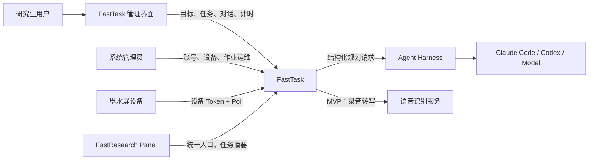
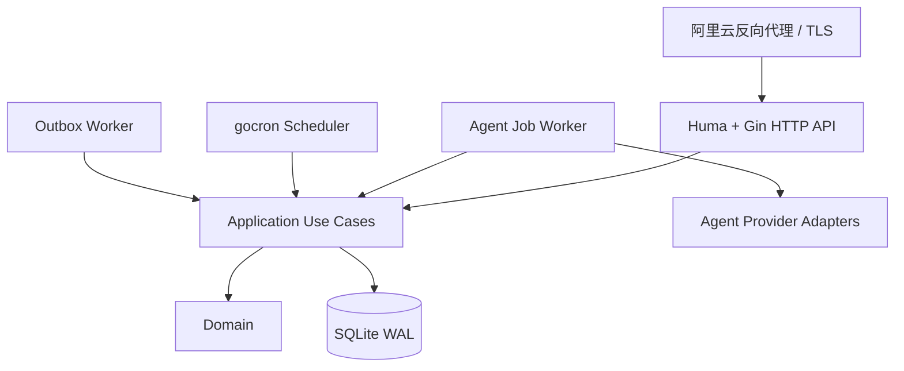
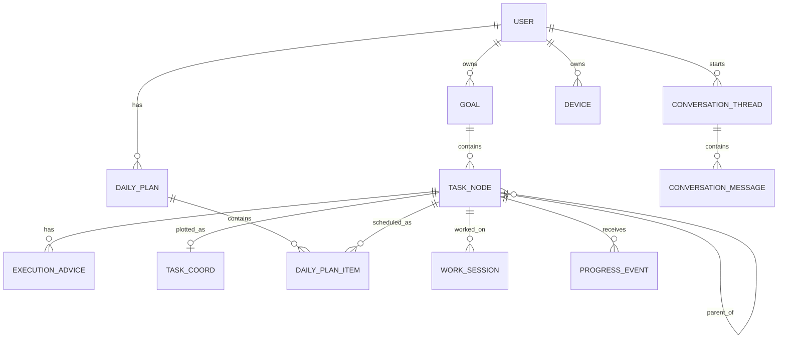
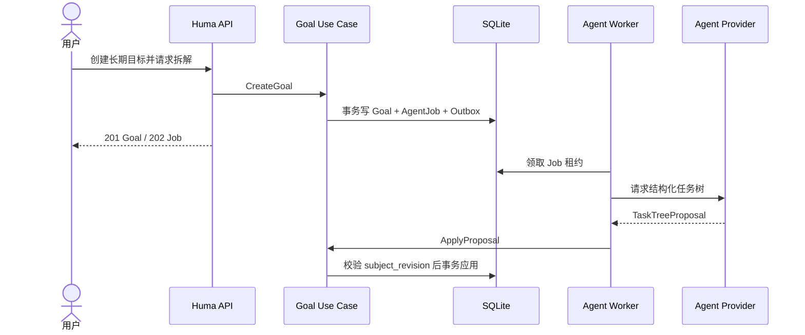

# FastTask 架构设计

> 文档状态：初版设计  
> 适用范围：FastTask MVP 及后续早期演进  
> 需求依据：`doc/req/overall.md`、`doc/req/this.md`  
> 参考实现：`/root/repo/zhongxin-mng-bkd`

## 1. 文档约定

本文使用以下标记：

| 标记 | 含义 |
|---|---|
| 明确需求 | 需求文档直接提出，必须满足 |
| 设计决策 | 为形成可实现闭环而确定的方案，后续可通过 ADR 调整 |
| 待确认 | 当前资料没有给出唯一答案，不阻塞总体架构但实现前应确认 |

FastTask 是新项目。本设计继承 `zhongxin-mng-bkd` 中适合单机 Go 服务的技术和工程经验，但不复制其具体业务模型，也不延续其中已经暴露出的全局依赖、事务不足、DTO 与数据库模型耦合、手写 OpenAPI 漂移等问题。

## 2. 系统定位

FastTask 面向时间可自主安排、目标长期且执行路径不确定的研究生和科研人员。它不是通用待办清单，而是一个由 Agent 辅助维护的长期目标推进系统。

系统核心闭环是：

```text
长期目标
  -> Agent 生成里程碑和任务树
  -> 用户确认或修正
  -> 每天选择最多 3 个核心推进项
  -> 用户按结果、步骤或专注时间推进
  -> 记录证据和阻碍
  -> 更新进度并持续修正任务树
```

明确需求包括：

- 将长期、抽象任务拆成周级和日级任务。
- 提供里程碑、多层级任务树和执行建议。
- 每天筛选最重要的三个任务。
- 困难情况下仍提供可以立即执行的最小行动。
- 支持用 2 至 3 个番茄时钟作为当日有效投入依据。
- 核心任务完成后可推荐阅读、学习等辅助输入任务。
- 提供可在桌面和移动浏览器使用的管理界面及后端能力。
- 提供墨水屏 Poll 接口。
- 与 FastResearch Panel 联动展示任务。
- Agent Harness 和模型可切换。

## 3. 架构目标

### 3.1 业务目标

- 保证任务树可以持续修正，而不是一次性生成后失去作用。
- 保证每日核心任务最多为三个，候选不足时允许少于三个。
- 区分“当日承诺完成”和“底层任务完成”。
- 保留历史计划、进度证据和任务树修改记录。
- 避免未完成任务机械滚动并无限堆积。
- Agent 输出必须可解释、可审计、可校验。

### 3.2 工程目标

- 单机优先，适合实验室 Mini 主机部署。
- 采用模块化分层单体，降低早期部署和运维成本。
- 核心领域规则不依赖 Gin、Huma、GORM、SQLite 或具体模型供应商。
- 使用依赖注入，禁止业务代码依赖包级全局数据库和客户端。装配由 `go.uber.org/fx` 在组合根完成，但构造函数保持普通 Go 函数签名，且 fx 只允许出现在 `internal/bootstrap` 和 `cmd`，详见 [ADR-0001](adr/0001-fx-composition-root.md) 与 [`doc/wiring.md`](wiring.md)。
- 通过 Huma 从代码生成 OpenAPI 3.1，保证实现、校验和契约一致。
- Agent 长任务、调度任务和外部联动可在进程重启后恢复。
- 跨聚合写操作具有明确事务边界。
- 为后续迁移 PostgreSQL、拆分 Worker 或接入更多 FastResearch 工具保留边界。

### 3.3 非目标

- MVP 不建设完整个人生活待办系统。
- MVP 不把一天全部时间排满。
- MVP 不建设通用 DAG Agent 编排平台，该能力属于 FastLabs 的主要边界。
- MVP 不引入 Kafka、RabbitMQ、Redis、独立工作流引擎或微服务集群。
- MVP 不实现 FastNews、FastRead、FastWrite 等项目的自动点对点业务调用；已提供通用外部导入收件箱和可选服务健康探测。

关于需求中的“每天三个任务”，本设计采用“最多三个、允许少于三个”的约束。这是明确的设计取舍：三个是注意力上限，不是必须填满的数量；当候选不足、全部任务阻塞或用户当天不可用时，伪造占位任务会违背产品目标。

## 4. 参考项目分析与继承策略

`zhongxin-mng-bkd` 是 Go 分层单体，主要调用链为：

```text
Cobra -> Bootstrap -> Gin Router/Middleware -> Handler -> op -> database -> GORM -> SQLite/MSSQL
```

其主要包职责如下：

| 层/包 | 参考项目职责 | FastTask 处理 |
|---|---|---|
| `cmd` | Cobra 命令、服务生命周期、运维命令 | 保留 CLI 入口，但不承载业务规则 |
| `bootstrap` | 配置、数据库、业务模块装配 | 保留组合根，改为显式构造和严格初始化顺序 |
| `server/handles` | Gin 路由、参数绑定、响应 | 改为 Huma Operation + Gin Adapter，使用独立 DTO |
| `op` | 应用服务和业务编排 | 拆成 `application` 和 `domain`，明确事务边界 |
| `database` | GORM Adapter/DAO | 改为按聚合定义 Repository 接口和 SQLite 实现 |
| `model` | 数据库模型、领域对象、API DTO 混用 | 分离 Domain、HTTP DTO 和 Persistence Record |
| `gocron` | 内存定时任务 | 保留触发器，但任务事实和重试状态持久化 |
| OpenAPI JSON | 手工维护参考文件 | 由 Huma 自动生成，代码为唯一事实来源 |

FastTask 明确改进以下问题：

- 不使用包级全局 DB、配置、Scheduler 和 HTTP Client。
- 不在生产启动时依赖 GORM `AutoMigrate`。
- 不让 Handler 直接实现复杂业务编排。
- 不把所有错误统一返回 HTTP 400。
- 不使用 `math/rand` 生成认证凭据。
- 不在 Handler 内启动不可追踪的关键 Goroutine。
- 不在数据库事务内调用 Agent 或外部 HTTP 服务。
- 不让 Agent 直接写业务表。

## 5. 总体架构

### 5.1 架构形态

设计决策：FastTask 初期采用模块化分层单体。

- 单一代码仓库和 Go Module。
- 默认构建为一个二进制。
- HTTP Server、Scheduler、Agent Worker 和 Outbox Worker 可以在同一进程运行。
- 同一二进制保留按角色独立启动能力，便于后续隔离 Agent 资源。
- 核心业务数据、异步作业和 Outbox 统一存储于 SQLite。

建议命令：

```text
fasttask serve
fasttask worker
fasttask scheduler
fasttask migrate
fasttask backup
fasttask restore
fasttask doctor
fasttask admin
fasttask version
```

MVP 可使用：

```text
fasttask serve --with-worker --with-scheduler
```

### 5.2 系统上下文



管理界面属于 MVP 的系统组成部分，不只是后端预留。它至少包含登录、今日计划、目标/任务树、对话与语音输入、专注计时、进度历史和设备设置，并同时适配桌面与移动浏览器。

### 5.3 容器视图



## 6. 分层设计

### 6.1 建议目录

```text
FastTask/
├── cmd/
│   └── fasttask/
│       └── main.go
├── internal/
│   ├── bootstrap/
│   ├── config/
│   ├── domain/
│   │   ├── identity/
│   │   ├── goal/
│   │   ├── plan/
│   │   ├── progress/
│   │   ├── conversation/
│   │   ├── agentjob/
│   │   ├── device/
│   │   └── integration/
│   ├── application/
│   │   ├── goal/
│   │   ├── plan/
│   │   ├── progress/
│   │   ├── conversation/
│   │   ├── agentjob/
│   │   ├── device/
│   │   └── integration/
│   ├── ports/
│   ├── adapters/
│   │   ├── http/
│   │   ├── persistence/sqlite/
│   │   ├── agent/
│   │   ├── scheduler/
│   │   ├── outbox/
│   │   ├── panel/
│   │   └── speech/
│   └── platform/
│       ├── auth/
│       ├── logging/
│       ├── health/
│       └── shutdown/
├── migrations/
├── deployments/
├── web/
├── doc/
└── go.mod
```

### 6.2 各层职责

#### `cmd`

- 定义 Cobra 命令和参数。
- 调用 Bootstrap 创建应用。
- 负责退出码，不直接访问 GORM 或实现业务规则。

#### `bootstrap`

- 加载并校验配置。
- 创建 Logger、SQLite、Repository、Agent Registry 和应用服务。
- 注册 Gin 中间件和 Huma Operation。
- 启动 Worker、Scheduler 和 HTTP Server。
- 按顺序执行优雅关闭。

Bootstrap 是唯一了解全部具体实现的组合根。

#### `web`

- 提供 FastTask 管理界面。
- 调用 Huma 生成的 OpenAPI 客户端访问后端。
- 实现今日计划、任务树、对话/语音、番茄计时、进度和设备管理。
- 不在前端复制服务端领域规则；最多三个核心项、Revision 和完成语义由后端强制保证。

#### `domain`

- 表达长期目标、任务树、每日计划、进度和状态机。
- 保证“核心任务最多三个”“当日完成不等于底层任务完成”等业务不变量。
- 定义按聚合划分的 Repository 接口。
- 不依赖 Gin、Huma、GORM、SQLite、Cobra 或具体 Agent SDK。

#### `application`

- 实现用例编排和权限检查。
- 开启事务、加载聚合、调用领域行为并保存。
- 在同一事务中创建 Agent Job 或 Outbox Event。
- 将领域结果转换为用例结果，不感知具体 HTTP 框架。

#### `ports`

- 定义应用层需要的外部能力接口。
- 包括事务管理、Agent Runner、Speech、Clock、ID Generator 和 Panel Client。
- 接口由使用方定义，避免形成包含全部能力的巨大接口。

#### `adapters/http`

- 使用 Huma 定义请求、响应、校验、认证要求和 OpenAPI。
- 使用 Gin 承载路由、中间件、CORS 和静态资源。
- 将 HTTP DTO 映射为 Application Command。
- 将领域错误映射为 Problem Details。

#### `adapters/persistence/sqlite`

- GORM Persistence Record。
- Repository 实现和显式 Mapper。
- 事务管理、查询优化和版本化 Migration。
- 不向上暴露 `*gorm.DB`。

#### `adapters/agent`

- 适配 Claude Code、Codex 或其他 Harness。
- 将统一结构化请求转换为 Provider 调用。
- 返回结构化结果，不直接修改 FastTask 数据库。

### 6.3 依赖规则

允许的依赖方向：

```text
cmd -> bootstrap -> adapters -> application -> domain
adapters/http -> application
adapters/persistence -> domain
application -> domain + ports
domain -> Go 标准库
```

禁止：

```text
domain -> Gin/Huma/GORM
application -> Gin/Huma/具体 Agent SDK
HTTP Handler -> GORM
Agent Worker -> 直接更新业务表
Repository -> HTTP DTO
```

## 7. 领域模块

### 7.1 Identity

职责：

- 用户、工作空间和成员角色。
- 用户会话、Refresh Token 和服务身份。
- 墨水屏设备 Token。
- FastResearch Panel 用户标识映射。
- 管理员操作审计。

设计决策：即使 MVP 只有一个实验室，也保留 `workspace_id`，避免数据模型永久绑定单租户假设。MVP 只启用一个默认工作空间和 `admin/member` 基础角色，不提供共享目标或复杂团队协作；共享授权属于 P1。

管理员可创建用户、更新档案与角色、重置密码、禁用账号、查看活跃 Session 并批量撤销会话。禁用、重置密码和显式撤销都会使 Session 立即失效；系统保留最后一名 active admin。

### 7.2 Goal 与 Task Tree

职责：

- 长期目标和验收条件。
- 里程碑、任务、最小行动和依赖关系。
- 任务树版本和结构变更。
- 任务状态、阻碍和进度聚合。

任务树节点语义包括：

| 类型 | 含义 |
|---|---|
| `milestone` | 可验证的阶段性成果 |
| `task` | 可以持续多日推进的真实工作 |
| `action` | 可以立即执行的最小步骤 |

设计决策：MVP 使用 `parent_id` 邻接表表达主层级，并用独立依赖表表达少量强依赖。不得将 FastTask 扩展成通用 DAG 引擎。

### 7.3 Planning

职责：

- 为用户和本地日期生成每日计划。
- 从候选任务中选择最多三个核心计划项。
- 保存选择原因、任务快照和算法版本。
- 管理辅助输入任务。
- 重新评估未完成任务，而非机械顺延。

每日计划是任务的当日推进切片，不是任务树副本。

### 7.4 Progress

职责：

- 记录结果、步骤、最小行动、专注时间和阻碍。
- 管理番茄或自由专注会话。
- 判断当日计划项是否满足。
- 在用户确认或满足严格规则后完成底层任务。

核心设计：

```text
完成最小行动/达到当日专注时长
  -> 可以满足 DailyPlanItem
  -> 默认不完成 Task
```

### 7.5 Conversation

职责：

- 保存对话线程和消息。
- 将自然语言请求转换为结构化命令或变更提案。
- 关联目标、任务、计划和 Agent Job。

自然语言不能直接变成数据库更新。高影响操作必须展示结构化变更并由用户确认。

### 7.6 Agent Job

职责：

- 持久化 Agent 作业和状态。
- 保存输入、输出 Schema 版本、目标对象版本和模型配置快照。
- 管理领取租约、超时、重试、取消和冲突。
- 防止旧 Agent 结果覆盖用户的新修改。

### 7.7 Device

职责：

- 注册和撤销墨水屏设备。
- 颁发只读设备 Token。
- 生成当天核心任务的设备视图。
- 支持 `ETag` 和 `304 Not Modified`。

### 7.8 Integration

职责：

- 向 FastResearch Panel 提供当前用户的任务摘要。
- 管理统一身份或短期登录 Token 的映射。
- 提供其他 FastResearch 工具向 FastTask 导入候选事项的通用入口，并保留后续专用适配器边界。

Panel 和其他项目不得直接读取 FastTask SQLite 文件。

## 8. 核心数据模型

以下是逻辑模型，最终字段以 Migration 和 Domain 定义为准。

| 聚合/表 | 关键字段 | 说明 |
|---|---|---|
| `workspaces` | `id`, `name`, `timezone` | 工作空间 |
| `users` | `id`, `display_name`, `timezone`, `status` | 用户 |
| `workspace_members` | `workspace_id`, `user_id`, `role` | 成员和角色 |
| `goals` | `id`, `owner_user_id`, `title`, `success_criteria`, `status`, `revision` | 长期目标 |
| `task_nodes` | `id`, `goal_id`, `parent_id`, `type`, `status`, `minimum_action`, `revision` | 任务树节点 |
| `task_dependencies` | `task_id`, `depends_on_task_id` | 强依赖 |
| `task_tree_revisions` | `goal_id`, `revision`, `reason`, `source`, `snapshot` | 任务树版本 |
| `task_coords` | `task_id`, `lens`, `x`, `y`, `source`, `pinned`, `rationale`, `revision` | 任务在预设透镜下的二维坐标，来自 Agent 提案或用户覆盖，见 `doc/lens.md` |
| `execution_advices` | `task_id`, `first_step`, `steps`, `fallback_action`, `version` | 执行建议 |
| `daily_plans` | `user_id`, `local_date`, `timezone`, `status`, `algorithm_version`, `current_revision` | 每日计划当前聚合 |
| `daily_plan_revisions` | `daily_plan_id`, `revision`, `input_snapshot`, `input_hash`, `plan_snapshot`, `reason` | 初始及同日重规划的完整版本 |
| `daily_plan_items` | `plan_id`, `plan_revision`, `task_id`, `kind`, `commitment`, `success_mode`, `status` | 当前或历史 Revision 的当日推进项 |
| `work_sessions` | `task_id`, `plan_item_id`, `started_at`, `ended_at`, `duration_seconds`, `status` | 专注记录 |
| `progress_events` | `goal_id`, `task_id`, `plan_item_id`, `type`, `evidence`, `occurred_at` | 不可变进度事实 |
| `conversation_threads` | `user_id`, `goal_id`, `status` | 对话线程 |
| `conversation_messages` | `thread_id`, `role`, `content`, `job_id` | 对话消息 |
| `agent_jobs` | `type`, `status`, `subject_id`, `subject_revision`, `input`, `output`, `lease` | 持久化 Agent 作业 |
| `outbox_events` | `event_type`, `payload`, `status`, `lease` | 可靠异步事件 |
| `devices` | `user_id`, `type`, `token_hash`, `status`, `last_seen_at` | 墨水屏设备 |
| `idempotency_records` | `principal`, `key`, `request_hash`, `response` | 写请求幂等 |

主要关系：



### 8.1 关键约束

- `UNIQUE(user_id, local_date, timezone)`：一个用户同一本地日期只有一个当前计划聚合。
- 初次生成计划时即写入 Revision 1 的输入与计划快照；每次重规划新增一条 `daily_plan_revisions`，再更新 `daily_plans.current_revision` 和当前计划项。因此当前版本和历史版本都具有可复现输入，不违反当前聚合唯一约束。
- 每个当前计划最多三个有效 `kind=core` 项。
- 计划项创建后 `kind` 不可修改。当天核心名额按“已满足核心项 + 当前 Revision 中未满足的有效核心项”计算且最多为三个；同日重规划中未满足并转为 `superseded` 的核心项不再占当前名额，已满足核心项继续占用当天名额。
- 同一计划不能重复引用同一个底层任务。
- 父节点必须属于同一目标，且不得形成循环。
- 已完成任务不能被物理删除，只能归档或由新版本替代。
- 历史计划项保存生成时的任务标题、承诺和最低行动快照。
- 同一用户默认最多一个活动 Work Session。
- `UNIQUE(task_id, lens)`：一个任务在一个透镜下只有一个坐标。用户覆盖后 `pinned=1`，Agent 提案不得再改写；坐标缺失或越界不影响提案应用。
- 坐标是旁路数据：不参与每日候选过滤与确定性排序，不修改 `tasks` 表结构，不影响墨水屏 Poll 与 Panel 摘要契约。
- Token 只保存哈希，明文仅创建时返回一次。

## 9. 关键业务链路

### 9.1 创建目标并拆解



规则：

- Agent 调用发生在数据库事务之外。
- Agent 输出先通过 JSON Schema 和领域校验。
- 应用结果时检查目标/任务树 Revision。
- 发生版本冲突时保存为冲突提案，不静默覆盖。

### 9.2 生成每日计划

```text
读取用户时区和有效计划
  -> 读取活跃目标和可执行候选任务
  -> 排除已完成、取消、硬阻塞和依赖未满足任务
  -> 读取近期进度、连续未完成和用户当天约束
  -> 生成或复用版本化 Agent 语义分析快照
  -> 确定性规则排序、去重并取前 0..3 项
  -> 事务写 DailyPlan、Items、输入快照和 Outbox
```

Agent 负责理解和建议，程序规则负责最终过滤、排序和数量上限。确定性承诺针对完整输入快照成立，该快照包含 Agent 分析结果、分析 Schema 版本和内容哈希；同一个计划生成过程不得重复调用模型取得不同分析后仍宣称输入相同。

### 9.3 完成当日计划项

```text
提交 result / step / time / minimum_action 证据
  -> 校验计划项 Revision 和证据
  -> 写 ProgressEvent
  -> 将 DailyPlanItem 标记为 satisfied
  -> 仅在底层完成标准满足且用户确认时完成 Task
  -> 更新目标派生进度
  -> 事务提交并写 Outbox
```

### 9.4 对话修正任务树

```text
保存用户消息
  -> 创建 AgentJob
  -> Agent 返回结构化 Patch Proposal
  -> 校验任务树 Base Revision、权限、循环和历史保护规则
  -> 用户确认高影响变更
  -> 创建新任务树 Revision 并事务应用
```

### 9.5 墨水屏轮询

```text
设备使用 X-Device-Token 请求
  -> 验证 Token 哈希和设备状态
  -> 获取绑定用户当前计划
  -> 只投影最多三个核心计划项
  -> 根据 ETag 返回 200 或 304
```

## 10. 异步任务与调度

### 10.1 持久化 Agent Job

不得使用 Handler 内裸 Goroutine 执行关键 Agent 操作。Agent Job 状态机：

```text
queued -> running -> succeeded
                  -> queued（可重试错误）
                  -> failed
queued/running -> cancelled
failed -> 新建 queued Job（手工重试，旧 Job 保持 failed）
```

作业至少保存：

- 作业类型、主体和主体 Revision。
- 版本化输入和输出。
- Agent、Provider、Model 和配置快照。
- 尝试次数、最早运行时间和租约。
- 幂等键、错误分类和完成时间。
- 当前 Attempt、租约版本和随机 `run_token`。

SQLite 领取作业采用短事务条件更新。每次领取递增租约版本并生成仅本次 Attempt 有效的 `run_token`。完成或回调必须同时匹配 Job ID、Attempt、租约版本、`run_token` 和当前状态；过期 Worker 的迟到结果被拒绝。外部 Agent 调用期间不持有事务。

### 10.2 Outbox

业务状态变更和 Outbox Event 在同一事务提交：

```text
业务写入 + INSERT outbox_events + COMMIT
```

Outbox Worker 在事务外处理 Panel 摘要更新、非关键通知和后续外部联动。消费者按事件 ID 幂等。

### 10.3 gocron 职责

gocron 只负责定时触发，不保存工作流事实。建议任务：

| 任务 | 触发方式 |
|---|---|
| 预生成每日计划 | 按用户本地日期/时间 |
| 扫描可执行 Agent Job | 秒级或分钟级 |
| 回收过期租约 | 每分钟 |
| 关闭过期日计划 | 按用户本地日界线 |
| 清理过期 Session/Token | 每小时 |
| SQLite 备份和一致性检查 | 每日低峰期 |

调度动作必须有数据库唯一键或幂等键，服务恢复后执行补偿扫描。

## 11. 事务、一致性与并发

### 11.1 必须使用事务的操作

- 创建目标、初始节点和拆解 Job。
- 应用完整任务树变更。
- 创建或替换每日计划及全部计划项。
- 完成 Work Session、写 Progress Event、更新计划项和进度。
- 修改业务状态并写 Outbox。
- 撤销设备并使 Token 失效。
- 业务写入、对应幂等记录和需返回的响应快照。

禁止在事务中执行 Agent、语音识别、Panel HTTP 调用或长时间文件操作。

### 11.2 乐观锁

`goals`、`task_nodes`、`daily_plans`、`daily_plan_items`、`agent_jobs` 使用整数 `revision`。HTTP 层通过 `ETag`/`If-Match` 映射。

版本冲突返回 `412 Precondition Failed`；业务状态冲突返回 `409 Conflict`。

### 11.3 幂等

创建资源、创建 Agent Job、完成计划项、轮换设备 Token 等写操作支持 `Idempotency-Key`。

相同主体、方法、路径和 Key：

- 请求摘要相同：重放首次结果。
- 请求摘要不同：返回 `409 IDEMPOTENCY_KEY_REUSED`。

### 11.4 一致性级别

- 单个 SQLite 事务内强一致。
- Agent 结果、Panel 摘要和其他外部联动最终一致。
- 墨水屏读取最新已提交计划。
- 历史 Progress Event 不可被原地覆盖，纠错通过补偿事件表达。

## 12. 安全边界

- 用户接口使用短期 Access Token 和可轮换 Refresh Token，或由统一 Panel 身份服务签发短期 Token。
- 设备使用独立、只读、可撤销的高熵 Token。
- 服务间 Token 使用独立 Audience 和 Scope。
- Token 由 `crypto/rand` 生成，数据库仅保存哈希。
- Agent 和模型输出视为不可信输入。
- 不在日志、OpenAPI 示例或 Agent Prompt 中写入密钥。
- Panel、Web 和设备均不得直接访问数据库文件。
- 只信任配置中明确列出的反向代理地址和转发头。
- 管理员默认不能自动读取用户私人任务正文；如需团队协作应单独授权。
- 本地账号密码使用经过审计的自适应密码哈希；登录实行账号/IP 组合限速和失败退避。
- Refresh Token 只保存哈希，成功刷新后轮换；旧 Token 复用触发会话族撤销和安全审计。

## 13. 可观测性

### 13.1 日志

结构化日志至少包含：

```text
timestamp, level, service, version, request_id,
user_id_hash, job_id, goal_id, operation_id,
duration_ms, error_code
```

不记录完整 Token、密码、模型密钥、原始音频和默认完整 Prompt。

### 13.2 健康检查

- `/health/live`：进程存活。
- `/health/ready`：数据库可用、Schema 版本兼容、必要 Worker 已启动。
- `/health/version`：版本、Commit 和构建时间。

### 13.3 指标

建议关注：

- HTTP 请求量和延迟。
- Agent 队列长度、运行时长、失败率和重试数。
- 每日计划生成成功率。
- SQLite Busy 次数和事务耗时。
- Outbox 积压和最老事件年龄。
- 最近一次备份成功时间。

## 14. 部署拓扑

```text
Internet
  -> 已备案域名
  -> 阿里云反向代理（TLS、限流、访问日志）
  -> 加密隧道或专用网络
  -> 实验室 Mini 主机
       -> FastTask systemd service          (Go，单二进制)
       -> 🟢 fasttask-sidecar service       (Node，可选，ADR-0005；模板见 deployments/systemd/)
       -> SQLite + WAL
       -> 数据、日志和备份目录
```

部署约束：

- 🟢 **[ADR-0005](adr/0005-libfx-agent-harness.md) 的 sidecar 是可选组件，部署形态仍是单 Go 二进制。**
  2026-09-23 的 spike（[`harness.md`](harness.md) §16）确认 agent 的模型适配层可在浏览器运行，
  sidecar 只用于支持缺 JSPI 的旧浏览器。是否部署按用户构成决定，约束见 [`tech.md`](tech.md) §21.4。
- 🟢 **进程托管有两种方式**，由 `FASTTASK_SIDECAR_SPAWN` 选择（默认 `true`，见 [`harness.md`](harness.md) §8.4）：
  Go 的 fx 生命周期启动并重启子进程；或由独立 systemd 单元托管，此时 Go **只做就绪探测与可用性判定**，
  不 fork、不发信号、不删 socket。两种方式下连续失败达阈值都只撤回 sidecar 模式，**WASM 模式不受影响**。

- FastTask 默认监听 `127.0.0.1` 或专用隧道地址。
- 同一 SQLite 主库只允许一个 Active FastTask 实例写入。
- 服务由 systemd 或容器运行时管理，不使用应用自制 PID Daemon。
- 数据库、配置、密钥和 Artifact 使用独立目录及最小文件权限。
- 数据库迁移是发布的显式步骤，迁移前执行一致性备份。

## 15. 演进路线

### 15.1 MVP

- 单进程 HTTP + Worker + Scheduler。
- SQLite WAL。
- 响应式 Web 管理界面、文本/语音输入、任务树、每日计划、番茄记录、墨水屏 Poll 和 Panel 摘要。
- Claude Code/Codex 中至少一个 Provider 可用，接口允许切换。

### 15.2 容量或隔离需求出现后

- 同机拆分 `serve` 和 `worker` 进程。
- 增加只读查询优化和缓存，但缓存不成为事实来源。
- Agent 运行使用独立系统用户或沙箱。

### 15.3 多机或高写入并发出现后

- 将 SQLite 迁移到 PostgreSQL。
- Agent Worker 可独立部署。
- 根据真实联动规模决定是否引入消息系统。

触发迁移的信号包括：持续 SQLite 写竞争、多个 Active 实例需求、数据库进入数十 GB 且查询明显退化、作业吞吐超过单机资源，或强制高可用要求。

## 16. 待确认事项

- FastResearch Panel 是否提供统一身份服务，还是仅提供入口和任务摘要。
- 每日计划是自动生效，还是首次打开时由用户确认。
- 用户是否可以同时维护多个活跃长期目标，以及目标间的默认选择策略。
- 管理员、导师或团队成员是否有查看共享目标的角色。
- 番茄计时满足当日项的默认阈值是 2 个还是 3 个。
- 设备 Token 默认有效期和轮询频率。
- 语音识别 Provider 和音频保留时长；语音输入本身按需求纳入 MVP。
- 同一天完成三个核心项后，是否允许追加新的核心项。本设计默认不允许，辅助项不受此限制。
- 任务树结构性变更是否全部需要用户确认。本设计建议 MVP 全部确认。

以上事项不会改变模块化单体、领域分层、Huma 契约、持久化 Job、事务和安全边界等核心架构。
