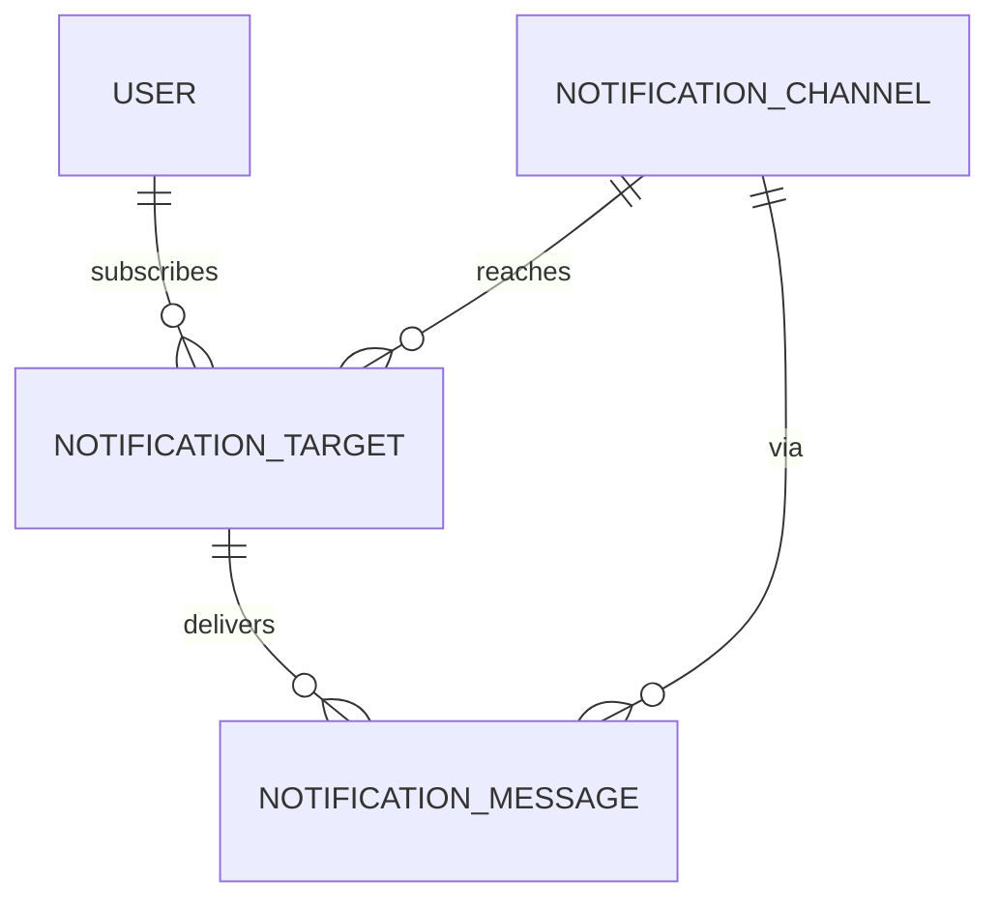

# 通知系统（Telegram / Bark / FCM / APNs）

> 状态：🟢 已实现（2026-09-24）  
> 代码：`internal/notify/`（提供方适配器）、`internal/application/notification.go`（通道与投递）、`internal/application/notificationtarget.go`（接收端）、`internal/httpapi/notifications.go`（接口）、`web/src/Notifications.tsx`（后台界面）、`internal/persistence/migrations/000010_notifications.up.sql`（表）  
> 相关：[`arch.md`](arch.md) §7.9、[`interface.md`](interface.md) §21、[`tech.md`](tech.md) §2.3/§11.5/§12、[`wiring.md`](wiring.md) §4/§5

## 1. 这份文档解决什么

FastTask 需要把「该你决定了」这类消息送到人身上，而不是等人打开网页。本期接入四个提供方，并让管理员在后台页面直接管理：

| 提供方 | 形态 | 通道凭据 | 接收端地址 |
|---|---|---|---|
| `telegram` | Telegram 机器人（Bot API） | Bot Token | Chat ID（用户、群或频道） |
| `bark` | Bark（iOS，自建或 api.day.app） | 无 | Device Key |
| `fcm` | Firebase Cloud Messaging HTTP v1 | 服务账号 JSON | 注册 Token |
| `apns` | Apple Push Notification service | `.p8` 私钥 + Key ID + Team ID + Bundle ID | Device Token（十六进制） |

不在本期范围：浏览器 Web Push（[`pwa.md`](pwa.md) §6 记录的原因不变：iOS 需先装到主屏幕）、邮件、飞书/企业微信、按用户的主题订阅与免打扰时段。第 12 节列出接口已经为它们留好的位置。

一条判断贯穿全文：**通知是礼貌，不是不变量。**业务事务已经提交之后才排队通知；发送失败绝不回滚用户的操作，也绝不让一次 Agent 运行失败。反过来，**通知里出现凭据是事故**，所以第 7 节的规则是硬边界。

## 2. 领域模型

三张表，各承担投递中的一个角色（`000010_notifications.up.sql`）：

```text
notification_channels   管理员配置的提供方：provider + endpoint + settings_json + 加密凭据
notification_targets    一个用户在一个通道上可达的地址：加密地址 + 哈希 + 掩码提示
notification_messages   投递队列，同时是投递日志：status / attempts / run_after / last_error
```

关系与级联：



删除通道会级联删除它的接收端和投递历史。理由：删通道等于吊销凭据，而凭据已失效的地址既不能再投递，也没有可诊断的价值，留着只是一份掩码后的设备凭据副本。

### 2.1 通道字段

| 字段 | 说明 |
|---|---|
| `provider` | `telegram`/`bark`/`fcm`/`apns`，与 `notify.Kinds()` 和迁移的 CHECK 约束同源 |
| `endpoint` | 提供方基址。留空即用适配器默认值（`api.telegram.org`、`fcm.googleapis.com`、按环境选择的 APNs 主机） |
| `settings_json` | 该适配器的非机密配置，键名见第 3 节 |
| `secret_ciphertext` | AES-GCM 密文，`aesgcm.v1:` 前缀 |
| `secret_hint` | 掩码提示，例如 `1234...oken` |
| `last_check_*` | 管理员最近一次凭据校验的时间与结论，纯诊断，不参与投递决策 |
| `name` | 唯一，与 `model_providers` 一致的约定 |

### 2.2 接收端字段

| 字段 | 说明 |
|---|---|
| `address_ciphertext` | 加密后的地址 |
| `address_hash` | 明文地址的 sha256，支撑 `UNIQUE(user_id, channel_id, address_hash)` |
| `address_hint` | 掩码提示，例如 `…7890`；短于 8 字符的地址整体掩码为 `••••` |
| `status` | `active` / `disabled`（人或程序停用）/ `invalid`（提供方永久拒绝） |
| `failure_count`、`last_error`、`last_sent_at` | 诊断，决定后台列表里一行该不该被怀疑 |

**地址就是凭据。**FCM 注册 Token 或 APNs Device Token 在手，等于拥有向某人手机推送的能力；Bark Device Key 同理。因此它们与通道凭据同等对待：加密入库、掩码出库、不进审计、不进日志、不出现在任何错误消息里。

## 3. 四个适配器

`internal/notify` 是 [`tech.md`](tech.md) §2.3 预留的通用 `Notifier` Port：应用层交出 `Message` 和地址，适配器是唯一知道线上格式的一方。新增提供方 = 新增一个文件 + `NewSender` 一个分支，不动应用层、接口层和表结构。

```go
type Sender interface {
    Kind() string
    Verify(ctx context.Context) error                                  // 证明凭据，且绝不打扰真实用户
    Send(ctx context.Context, address string, msg Message) (Receipt, error)
}
```

`NewSender(spec)` 的构造过程就是配置校验：它做完该提供方需要的全部结构检查（缺 Bot Token、`.p8` 解析失败、服务账号 JSON 不是 `service_account`），并且不发任何网络请求。后台保存通道时调用的正是它，所以「填错」在管理员打字的那一刻被拒绝，而不是在凌晨三点第一次投递时。

### 3.1 Telegram

- 凭据：Bot Token（`@BotFather`）。
- `endpoint` / `settings["api_base"]`：API 基址，默认 `https://api.telegram.org`；自建 Bot API 服务器或出口代理时改这里。
- 发送：`POST {base}/bot{token}/sendMessage`，纯文本。**不使用 `parse_mode`**：标题来自用户手写的任务文本，转义失败会导致整条消息发不出去，而一条朴素的通知好过一条没人收到的漂亮通知。
- 校验：`getMe`。
- 判定：`400 chat not found`、`403 bot was blocked / user is deactivated` → 地址失效；`429` → 可重试，并把 `retry_after` 写进原因；`401` → 通道凭据问题（`ErrUndeliverable`）。
- 前置条件：机器人必须已经在群或频道里，这是 Telegram 的决定，适配器只如实汇报。

### 3.2 Bark

- 凭据：无。Bark 服务器靠 Device Key 认权限，所以密钥属于**接收端**，不属于通道。
- `endpoint` / `settings["server"]`：服务器基址（必填），例如 `https://api.day.app` 或自建 `bark-server`。
- 可选 settings：`group`（默认 `FastTask`，让通知在 iOS 里聚成一个可调分组）、`sound`、`icon`、`level`（`active`/`timeSensitive`/`passive`/`critical`）。
- 发送：`POST {server}/push`，Device Key 放在**请求体**里，不放在路径上。`{server}/{key}` 那种写法会把用户唯一的凭据复制进沿途每一级代理的访问日志。
- 校验：`GET {server}/ping`，要求 200 且回答里含 `success`/`pong`；一个返回 200 的 nginx 不算 Bark 服务器。
- 判定：`404`、或 `400` 且原因提到 device key → 地址失效；`5xx`/`429` → 可重试。响应里的 `code` 兼容数字与字符串两种写法。

### 3.3 FCM

- 凭据：Firebase 控制台下载的服务账号 JSON（`type=service_account`）。
- `settings["project_id"]`：可覆盖，默认取 JSON 内的 `project_id`。
- `endpoint`：默认 `https://fcm.googleapis.com`；`token_url` 取自 JSON（测试用它把 OAuth 换 token 指向本地替身）。
- 认证：用服务账号私钥签 JWT，向 Google 换取 access token，缓存在适配器内、到期前 30 秒刷新。**不换用 legacy server key**，那条路 Google 已经关掉。
- 发送：`POST {base}/v1/projects/{project}/messages:send`，`notification` + `data` + `android.priority=high` + `android.collapse_key`，深链走 `fcm_options.link`。
- 校验：完成一次 OAuth 换取，证明服务账号可用。**无法**证明某个 token 可达——那是设备维度的事，FCM 也不提供不带 token 的试跑。
- 判定：`NOT_FOUND`（`Requested entity was not found`）、`INVALID_ARGUMENT` 且提到 token → 地址失效；`UNAUTHENTICATED`/`PERMISSION_DENIED` → 通道问题；`5xx`/`429` → 可重试。

### 3.4 APNs

- 凭据：`.p8` 私钥（PEM，PKCS#8 或 openssl 转出来的 SEC1 都接受）。
- settings：`key_id`、`team_id`、`topic`（Bundle ID）必填；`environment`（`production` 默认 / `sandbox`）决定默认主机；`sound` 可选。
- 认证：本地签 ES256 provider token（`iss`=Team ID，`kid`=Key ID），复用 50 分钟。Apple 允许一小时并对签名频率限流，所以「每条消息签一次」本身就是错误用法。
- 传输：**只支持 HTTP/2**。`notify.NewHTTPClient` 打开 `ForceAttemptHTTP2` 正是为了这个适配器；单测用 `httptest` 的 HTTP/2 TLS 监听器断言 `r.Proto == "HTTP/2.0"`，因为悄悄退回 HTTP/1.1 的适配器会通过所有测试而在生产里一条都发不出去。
- 载荷：`aps.alert` + `aps.sound`，FastTask 自己的元数据统一放在顶层 `fasttask` 键下（`topic`、`url` 以及事件的 `data`），这样 App Extension 读元数据时不必了解 `aps` 的形状，调用方放在 `data` 里的键也无法覆盖告警本身。`alert` 永远有正文：APNs 接受一个没有文字的 alert，然后什么都不显示。
- 头部：`apns-topic`、`apns-push-type: alert`、`apns-priority: 10`、可选 `apns-collapse-id`；`apns-id` 回执记入 `provider_message_id`。
- 判定：`410`、`400 BadDeviceToken`、`DeviceTokenNotForTopic` → 地址失效；`403 InvalidProviderToken` 等 → 通道问题，并丢弃缓存的 provider token；`PayloadTooLarge`、`TopicDisallowed` → 不可投递；`5xx`/`Shutdown` → 可重试。

### 3.5 地址形状检查

`notify.ValidateAddress(provider, address)` 在登记接收端时做一次宽松的形状检查（Chat ID 是数字或 `@username`、Bark Key 是 8–128 位、FCM Token 20–4096 位、APNs Token 是偶数长度十六进制）。它不试图比提供方更懂格式——提供方才是权威，被它拒绝的地址会按第 5 节退役。它拦的是把邀请链接或整条推送 URL 粘进地址框这类失误，否则那会变成一个每次投递都失败、并且悄悄停掉某人全部通知的接收端。错误消息里的地址一律掩码。

## 4. 接收端语义

- **登记即幂等**：同一用户、同一通道、同一地址重复登记不会撞唯一索引，而是**复活原行**（状态回到 `active`、失败计数清零、备注更新、保留历史）。推送 token 每次重装应用都会变，第二次登记是同一台设备，不是冲突。
- **换地址**：`PATCH` 带 `address` 即视为重新登记，替换密文/哈希/提示并清空失败历史。
- **停用与失效不同**：`disabled` 是人关掉的，`invalid` 是提供方判定地址已死。两者都不投递；把 `disabled` 改回 `active` 会同时清掉提供方的旧判决和失败计数，因为这等于有人断言「它又可达了」。
- **自助与代管**：用户通过 `/notifications/targets` 只能操作自己的行，作用域来自 token 而不是请求体（请求体里根本没有 `user_id` 字段）；管理员通过 `/admin/notifications/targets` 可以为任意用户登记，并写审计。
- 越权访问别人的接收端返回 **404 而不是 403**：403 会确认这个 id 存在。

## 5. 投递语义

```text
业务事务提交
  -> Publish(userID, Event)：为该用户每个 active 接收端 × active 通道写一行 queued（同事务批量插入）
     -> 调度器 sweeper（每 5 秒）或 Worker 兜底（每 5 秒至多一次）调用 DispatchDue
        -> 认领：UPDATE ... SET status='sending', attempts+1, run_after=now+5min
                WHERE id=? AND status=? AND attempts=?      -- 条件更新，只有一个调度器能赢
        -> 事务外调用提供方（doc/tech.md §11.2：外部调用不持写锁）
        -> 记录：同样带认领条件写回，慢的一方覆盖不了接管的一方
```

三种结局，来自适配器的三种错误：

| 情况 | 消息 | 接收端 |
|---|---|---|
| 成功 | `sent` + `provider_message_id` | 失败计数清零，记 `last_sent_at`；若曾是 `invalid` 则回到 `active` |
| `ErrInvalidTarget`（地址已死） | `failed`，不重试 | 置 `invalid`，记原因 |
| `ErrUndeliverable`（通道凭据/载荷问题） | `failed`，不重试 | **保持 `active`**：修好通道时订阅应该还在 |
| 其他（网络、5xx、429） | 退避后重试，`attempts` 到 `max_attempts`（3）为止 | 失败计数 +1 |

- 退避：`30s → 60s → …`，上限 15 分钟（[`tech.md`](tech.md) §11.3）。
- **租约**：`run_after` 在认领时被推到 `now+5min`。进程在发送途中被杀，行会在租约到期后重新变为可认领，`attempts` 继续累加；租约未到期时任何人都不能抢，否则一次慢网络就会被投递两遍。
- **两个排水口**：调度器 sweeper 是正主；`serve --with-worker` 或独立 `worker` 角色没有调度器，所以 Worker 也排水（每 5 秒至多一次）。认领是条件更新，这正是两个排水口可以共存的原因。
- **日志有界**：`Prune` 每进程每小时至多一次，删掉超过保留期（默认 14 天）的 `sent`/`failed` 行；部分索引 `idx_notification_messages_prune` 只覆盖已结束的行。
- **总量上限**：单用户一次事件最多扇出 40 个接收端，一次广播最多 5000 个。超出这个规模的部署不是单二进制 + SQLite 的部署，而让一个录入失误变成刷屏是更坏的结果。
- `Publish` 的返回值为 0 是常态（用户什么都没配），不是错误。

## 6. 凭据校验与测试发送

后台有两个动作，语义不同，都不允许打扰真实用户：

- **验证凭据**（`POST /admin/notifications/channels/{id}/verification`）：调用适配器的 `Verify`。Telegram 用 `getMe`，Bark 用 `/ping`，FCM 完成一次 OAuth 换取，APNs 向一个不可能存在的 token（64 个 0）推送——APNs 先验凭据再看 token，所以 `BadDeviceToken` 恰好证明密钥、Team 和 Topic 都被接受，而 `InvalidProviderToken` 说明没有。结论写入 `last_check_at`/`last_check_status`/`last_error`，**不改动 `revision`**：配置没变，客户端手里的 ETag 就该继续有效。
- **测试发送**：两种。向一个**未登记的地址**试发（`.../channels/{id}/test`，不落任何行）；向一个**已登记的接收端**试发（`.../targets/{id}/test`，落一条 `topic=notification.test` 的记录，`max_attempts=1`，所以它不会在管理员已经走开之后几分钟才姗姗送达）。

两者都写审计，但审计里**没有地址**，只有 `delivered` 与否。

## 7. 安全边界

1. 凭据与地址都用 `FASTTASK_PROVIDER_ENCRYPTION_KEY` 派生的 AES-GCM 密钥加密。通知用**独立的域分隔标签**（`fasttask:notification:v1:`），所以一段模型 Provider 的密文不能被当作通知凭据解出来，反之亦然；密钥缺失时加密**失败关闭**，不会退化成明文入库。
2. 任何接口都不回显凭据或地址：通道回来的是 `secret_hint` + `secret_set`，接收端回来的是 `address_hint`。编辑表单里凭据留空即保留原值——这是「服务器从没给你看过」唯一诚实的对应交互。
3. 审计事件记录「谁在什么时候改了哪个通道」，不记录填写的内容（更新时只记 `secret_replaced: true`）。
4. 错误消息只携带提供方自己的诊断，并且经过截断与 `PRIVATE KEY` 片段遮蔽；适配器构造的错误里不含带 token 的 URL（[`tech.md`](tech.md) §12）。
5. HTTP 客户端由服务持有并复用连接，**拒绝跟随重定向**：Authorization 头或路径里的凭据不能被重放到运维没有配置的主机上。TLS 最低 1.2，响应体读取上限 1 MiB。
6. 管理端点全部要求管理员（`currentAdmin`）；自助端点全部按 token 里的用户作用域。
7. 用户能看到 `/notifications/channels` 里 `active` 的通道（否则无法订阅），看到的是名称、提供方与设置，不含凭据。

## 8. 配置

| 变量 | 默认 | 说明 |
|---|---|---|
| `FASTTASK_NOTIFICATION_ENABLED` | `true` | 总开关。关闭后 `Publish` 空转、调度器不认领，但配置仍可读，便于不重填凭据就恢复 |
| `FASTTASK_NOTIFICATION_TIMEOUT_MS` | `10000` | 单次提供方调用的时间预算，1000–60000 |
| `FASTTASK_NOTIFICATION_BATCH` | `20` | 一次排水认领多少条，1–100 |
| `FASTTASK_NOTIFICATION_RETENTION_HOURS` | `336` | 投递日志保留时长（小时），1–2160 |

`Config` 里的字段写作 `NotificationsDisabled`（取 `!envBool(...)`）。这是有意的：字面量构造的 `Config`（所有测试，以及将来任何嵌入方）必须**不会**悄悄关掉投递——一个静默停止通知的通知系统，是没人会发现的那种故障。

通道与凭据不在环境变量里，全部由后台写入数据库。

## 9. HTTP 接口

字段级契约以 OpenAPI 为准，分组说明见 [`interface.md`](interface.md) §21。

```text
用户自助
  GET    /api/v1/notifications/channels                    可订阅的 active 通道
  GET    /api/v1/notifications/targets                     我的接收端
  POST   /api/v1/notifications/targets                     登记（201）
  PATCH  /api/v1/notifications/targets/{target_id}         改备注/状态/地址（If-Match）
  DELETE /api/v1/notifications/targets/{target_id}         删除（204）
  POST   /api/v1/notifications/targets/{target_id}/test    给自己发一条测试
  GET    /api/v1/notifications/messages                    我的投递记录

后台
  GET|POST        /api/v1/admin/notifications/channels
  PATCH|DELETE    /api/v1/admin/notifications/channels/{channel_id}
  POST            /api/v1/admin/notifications/channels/{channel_id}/verification
  POST            /api/v1/admin/notifications/channels/{channel_id}/test
  GET|POST        /api/v1/admin/notifications/targets
  PATCH|DELETE    /api/v1/admin/notifications/targets/{target_id}
  POST            /api/v1/admin/notifications/targets/{target_id}/test
  GET             /api/v1/admin/notifications/messages
  POST            /api/v1/admin/notifications/broadcast
  POST            /api/v1/admin/notifications/dispatch
```

## 10. 产品事件挂钩

`internal/application/notificationhooks.go` 是全部挂钩点，都是自由函数而非方法：`AgentService` 已经在 [`wiring.md`](wiring.md) §9 的方法预算上，而通知不是 Agent 运行时的一部分，它只是运行停车或失败那一刻的一行调用。

| 主题 | 触发点 | 为什么值得打扰 |
|---|---|---|
| `proposal.pending` | `harnessTools.parkForApproval`：提案已暂存、运行转入 `awaiting_approval` | 停车的运行占着该线程唯一的活跃名额（[`agent.md`](agent.md) §4）。关掉标签页的用户没有任何别的途径知道 Agent 在等他，也没法在该线程发起新运行 |
| `agent.run_failed` | `runSession.failRun` 与 `AgentService.failHarnessRun` | 失败的运行只在用户已经不再看的那个线程里可见 |
| `notification.test` | 后台/自助的测试发送 | 运维动作 |
| `notification.broadcast` | 后台广播 | 运维动作 |

每个挂钩都是 fire-and-forget（`_, _ = Publish(...)`）：事件已经提交，通知失败不能把它变成用户要重试的错误。

新增一个事件通知的判据：**这条消息是否要求某人在别处做一件事，或者告诉他一件他已经等的事。**每日计划生成、任务完成这类用户刚刚亲手做完的事不满足——那只是噪音。

## 11. 后台界面

`web/src/Notifications.tsx`，后台的「通知管理」标签页。四个提供方的差异全部由 `PROVIDERS` 这张表驱动（凭据标签与是否多行、endpoint 标签与是否必填、settings 字段与下拉选项、地址标签与示例、一句提供方特有的说明），所以表单里没有第四份复制粘贴的 JSX，加第五个提供方是加一条表项。

- 左列：新增通道。按提供方显示对应字段，必填项没齐时创建按钮禁用（与服务端同一套判断，只是提前到打字时）。
- 右上：投递记录筛选、「立即投递」（手动排水一次并回报送达/重试/失败/失效数）、「广播」。
- 通道卡：提供方与状态、接收端 `在用/总数`、掩码凭据、服务地址、最近验证结论与时间、失败原因；动作是 接收端 / 验证凭据 / 试发 / 编辑 / 停用启用 / 删除。编辑时凭据字段留空即保留。
- 接收端面板：按通道列出，行内是 用户 · 备注 · 掩码地址 · 状态 · 失败次数 · 最近送达，加一行「为某用户登记地址」的表单。
- 投递记录：一行一条，状态、用户、通道、掩码地址、时间、`主题 · 第 n/m 次 · 提供方消息 id`，失败原因用错误色但不加背景——它是需要看见的操作信息，不是标题。

视觉遵循 [`../AGENTS.md`](../AGENTS.md)：接收端和日志是行列表 + hairline 分组，不是卡片，也不套染色面板；颜色只用于状态和错误。

## 12. 为下一个提供方留的位置

- 新的推送渠道：`internal/notify/` 加一个文件 + `NewSender` 一个分支 + `Kinds()` 一项 + 迁移 CHECK 约束 + `PROVIDERS` 表一条。表结构、应用层、接口和界面都不用改（`provider` 是字符串，`settings_json` 是自由映射）。
- 用户维度的主题订阅、免打扰时段：`notification_targets` 之外加一张偏好表，`Publish` 在扇出前过滤。当前每个 active 接收端都收。
- Web Push：需要 VAPID 密钥与浏览器的 `push` 事件，通道凭据形态与现有四个不同（公钥 + 私钥 + 订阅对象），但 `Sender` 接口容得下。

## 13. 验证

- 适配器：`internal/notify/{telegram,bark,fcm,apns}_test.go`。真实密钥材料（测试里生成的 RSA / ECDSA 私钥）、`httptest` 替身、APNs 走真正的 HTTP/2 TLS 监听器并断言 `HTTP/2.0`；覆盖成功、地址失效、通道不可投递、限流可重试、凭据校验、token 缓存与复用、重定向被拒、错误里不含凭据。
- 应用层：`internal/application/notification_test.go`（28 个用例）覆盖加密入库与独立密钥标签、按适配器校验、修订冲突、级联删除、扇出规则、四种投递结局、租约与并发认领（两个排水口只有一方拿到行）、退避上限、日志裁剪、审计不含凭据、越权 404。
- 接口层：`internal/httpapi/notifications_test.go`，含「所有响应体与审计里都不出现凭据或完整地址」的断言。
- 装配：`internal/bootstrap/notification_test.go` 用 fx 图证明**调度器角色**与**Worker 角色**都真的会排水——队列只写不发是这套东西最可能的静默故障。
- 契约：`internal/httpapi/testdata/openapi.golden.json` 已重新生成，差异是纯新增（15 条路径、17 个 schema，既有路径与组件逐字节不变）。
- 端到端：`scripts/e2e.mjs` 增加了通知段。设置 `FASTTASK_E2E_PROVIDER` 指向一个会应答的替身时断言真实送达（实测 `verified: true`、`delivery: sent`、`attempts: 1`）；不设置时指向不可达地址，断言凭据校验如实报告失败、消息被认领并进入退避重试（实测 `verified: false`、`delivery: queued`、`attempts: 1`）。
- 渲染验证（2026-09-24，headless chromium + CDP，对象是 `web/dist` 经 Go 静态路径提供的构建产物，与生产同一条代码路径）：26 条断言全部通过，覆盖后台「通知管理」页的实际操作而非源码推断——表单随提供方切换（Telegram 的 Bot Token 换成 APNs 的 Key ID / Team ID / Bundle ID 与多行 `.p8` 字段）、必填项没齐时创建按钮保持禁用、创建后卡片出现并显示 `接收端 n/m` 与掩码凭据、点「验证凭据」后卡片记下结论与时间、试发对话框在填入地址前不允许发送、填入后收到「测试消息已送达」、为某用户登记接收端后行内只显示备注与掩码地址、广播后「立即投递」回报 `本次投递：送达 1，重试 0，失败 0`、投递记录出现「已送达」行并带通道名与掩码地址、状态筛选真的收窄列表、删除通道后卡片消失、整页渲染文本里既没有 Bot Token 也没有完整 Chat ID、400px 下无横向溢出且布局收成单列、过程中没有任何通知接口返回 4xx/5xx 也没有未捕获异常。这一轮查出并修掉一个只有真浏览器才暴露的缺陷：`act()` 在 `run()` 之后无条件弹通用文案，把「立即投递」刚回报的送达计数在一毫秒内覆盖成「待发通知已处理」；现在 `run()` 返回字符串即以其为准，队列为空时明确说「没有到期的通知，队列已空」。
- **没有对真实的 Google 与 Apple 端点验证过 FCM 和 APNs。**本环境没有 Firebase 项目，也没有 Apple 开发者密钥，这两个适配器只跑过本地替身：真实的密钥材料（测试内生成的 RSA 与 P-256 私钥）、真实的 JWT 签名与 OAuth 换取、真实的 HTTP/2 TLS 监听器，但对面是 `httptest`。协议路径、错误分类与凭据缓存因此是被覆盖的，「我们的项目 ID 和 Bundle ID 在真实提供方那里被接受」不是。运维上的对应动作是：填完真实凭据先点「验证凭据」——FCM 会完成一次真实的 OAuth 换取，APNs 会向一个不可能存在的 token 推送并据 `BadDeviceToken` 与 `InvalidProviderToken` 的区别判定，两者都不会打扰任何真实设备。
- 真机链路（2026-09-24，构建后的二进制 + 空库迁移到 schema 10）：四个通道全部创建成功（含真实形状的服务账号 JSON 与 `.p8`）；缺令牌的通道返回 422 并带 `telegram: a bot token is required`；Telegram `getMe` 与 Bark `/ping` 校验通过；错误 token 校验返回 `verified=false` 与原因；广播 → 运行中的调度器投递 → 替身收到 `sendMessage`，正文为 `维护通知\n今晚 23:00 停机十分钟`，`provider_message_id=4217`；死地址返回 `invalid_target=true`；数据库里 `secret_ciphertext` 与 `address_ciphertext` 均为 `aesgcm.v1:` 前缀；服务日志、响应体、审计里都不含 Bot Token。
